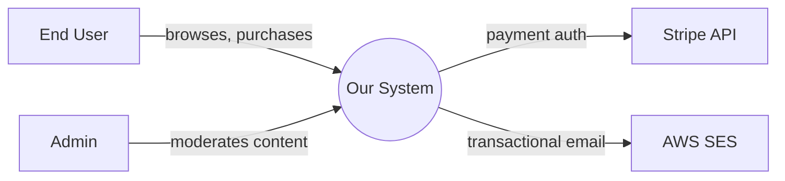

# Reference: Architecture Recovery (Phase 2)

Use the C4 model. It scales from "5-minute overview" to "I need to debug this" without making you invent new diagram conventions.

## The four levels (you produce L1–L3; L4 is the code itself)

- **L1 Context** — the system as a black box plus everyone it talks to.
- **L2 Container** — deployable/runnable units inside the system. A container is "something that runs": a service, a database, a queue broker, a single-page app.
- **L3 Component** — the major groupings of code inside one container (modules, packages, layers).
- **L4 Code** — classes, functions. Don't draw this; the code itself is the spec.

## L1 — Context diagram

What goes in:
- The system (one box).
- Human user types (anonymous user, logged-in user, admin, support agent, etc.). Distinct roles only.
- External systems it calls or that call it (Stripe, SendGrid, internal billing API, a partner webhook, an OAuth provider).

What does NOT go in:
- Internal services. Those are L2.
- Databases. Those are L2.

**Mermaid example:**


How to find externals: search for outbound HTTP calls (`fetch`, `axios`, `http.Client`, `requests.`, `RestTemplate`), SDK imports (`stripe`, `@aws-sdk/...`, `twilio`), and webhook endpoints (routes that look like `/webhooks/<provider>`).

## L2 — Container diagram

What's a container, concretely:
- A service (the API, a worker, a scheduler).
- A SPA / mobile app.
- A datastore (Postgres, Redis, S3, Elasticsearch).
- A message broker (Kafka, RabbitMQ, SQS).
- A reverse proxy or gateway, if architecturally significant.

For each container, label: name, tech ("Node.js + Express" / "Postgres 14" / "Redis"), and one-sentence responsibility.

Show the **protocol** on arrows: `HTTP/JSON`, `gRPC`, `AMQP`, `SQL`, `RESP`, `WebSocket`. This is high-value information often missing from architecture docs.

How to recover containers from code:
- Multiple `Dockerfile`s or services in `docker-compose.yml` → multiple containers.
- A monorepo with `services/`, `apps/`, `packages/` → likely multiple containers; check each `package.json`'s `start` script.
- Kubernetes manifests: each `Deployment` or `StatefulSet` is a container.
- Database connection strings in config → datastore containers.
- Queue client initialization → broker container.

If there's just one process, say so. "Modular monolith" is a legitimate L2 outcome — one container with rich internal components.

## L3 — Component diagram

Now you're inside one container. Components are the chunks of code that have a clear responsibility:

- In a layered Spring/Django/NestJS app: controllers, services, repositories, domain models.
- In a hexagonal/clean architecture: adapters (in/out), use cases, domain, ports.
- In a feature-sliced layout: each feature folder is a component, plus shared infra.
- In an MVC monolith: controllers grouped by resource, services grouped by domain, models.

**One section per container in `03-components.md`:**

```markdown
## Container: api-service

### Components
- **HTTP Controllers** (`src/api/`) — request parsing, response formatting, calls into use cases.
- **Use Cases** (`src/usecases/`) — orchestrate domain logic, framework-free.
- **Domain** (`src/domain/`) — entities, value objects, domain services.
- **Repositories** (`src/infra/db/`) — Postgres access via Prisma.
- **External clients** (`src/infra/clients/`) — Stripe, SendGrid wrappers.

### Component diagram
\`\`\`mermaid
flowchart TB
  HTTP[HTTP Controllers] --> UC[Use Cases]
  UC --> DOM[Domain]
  UC --> REPO[Repositories]
  UC --> EXT[External Clients]
  REPO --> PG[(Postgres)]
  EXT --> Stripe & SES
\`\`\`
```

## Data architecture (`04-data.md`)

Recover the schema. Priority order:

1. **Migrations** (Flyway, Liquibase, Alembic, ActiveRecord, Prisma Migrate, Django migrations) — most reliable, shows history.
2. **ORM models** — fast to read; may diverge slightly from real schema.
3. **A live DB** — if available, you can query `information_schema`. Usually not available.
4. **SQL files** — for raw-SQL projects.

Produce:
- ER diagram of major entities (skip junction tables and audit tables unless central).
- One paragraph per major entity: what it represents, key invariants, lifecycle.
- Caching: any Redis usage? Note keys, TTLs, invalidation triggers.
- Migrations: count, naming convention, any pending/rollback patterns visible.

## Deployment view (`05-deployment.md`)

What to look for:
- `Dockerfile`(s): base image, build stages, run user, exposed ports.
- `docker-compose.yml` / `compose.yaml`: dev-time topology.
- `k8s/`, `helm/`, `kustomize/`: production topology — replicas, resources, secrets, ingresses.
- `terraform/`, `pulumi/`, `cdk/`: cloud infrastructure — VPCs, RDS, S3, IAM.
- `.github/workflows/`, `.gitlab-ci.yml`, `Jenkinsfile`, `circle.yml`: deployment pipeline.
- `serverless.yml`, `sam.yaml`, `wrangler.toml`: serverless deployment.

If none of this exists in the repo, write: "No infrastructure-as-code in this repository. Deployment is likely handled outside the repo — confirm with ops."

## Cross-cutting concerns (`06-cross-cutting.md`)

These are the things that touch every feature. Document each one as: *mechanism + where it lives + how features consume it*.

- **Auth**: JWT? Session? OAuth proxy? Where's the middleware/guard? What's the user identity object?
- **Config**: env vars? config files? secret manager? Where's the schema/validation?
- **Errors**: central error handler? error classes hierarchy? how are 4xx vs 5xx distinguished?
- **Logging**: which library? structured or text? log levels in use? request correlation IDs?
- **Tracing**: OpenTelemetry? proprietary?
- **Feature flags**: hardcoded? LaunchDarkly? env-based?
- **Validation**: schema lib (Zod, Pydantic, Joi, class-validator)? where applied?

Each of these will be referenced repeatedly in feature docs — getting them right here means feature docs can just say "uses the standard auth middleware (see cross-cutting)" without repeating themselves.

## Useful greps to bootstrap

```bash
# External HTTP calls (refine per language)
rg -n "fetch\(|axios\.|http\.Client|requests\.(get|post|put|delete)|RestTemplate"

# Database connections
rg -ni "postgres|mysql|mongodb|redis" --type-add 'cfg:*.{yml,yaml,toml,json,env*}' -t cfg

# Queue/broker usage
rg -ni "kafka|rabbitmq|sqs|sns|pubsub|bullmq|celery|sidekiq"

# Auth middleware
rg -n "passport|jwt|@UseGuards|require_auth|login_required|authorize"
```
