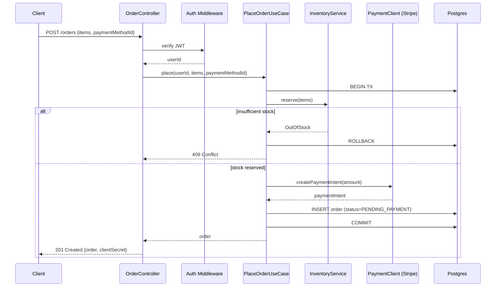
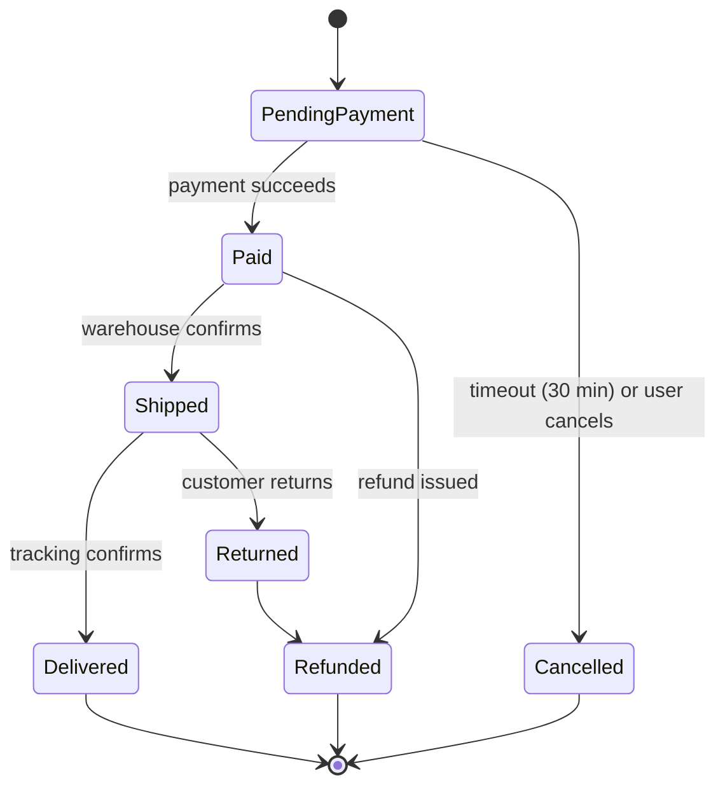

# Reference: Detailed Design Per Feature (Phase 4)

The goal: a new engineer can read one feature doc and confidently make a change to that feature. Not "understand the code"; *change it*.

## How deep is "enough"

For each feature, the doc should let the reader answer:

1. What does the feature do, in user terms?
2. Where does control enter? (file:line)
3. What's the request → response sequence? Where are the decision points?
4. What data does it read/write?
5. What can go wrong, and how does the code handle it?
6. What does it depend on (other features, external services)?
7. What's the obvious next change someone would want to make, and what would they touch?

If the doc answers all seven, stop. Going deeper is line-by-line narration, which is what the code is for.

## Sequence diagrams that earn their place

A bad sequence diagram:
```
User -> Server: request
Server -> DB: query
DB -> Server: result
Server -> User: response
```
This says nothing. The reader could draw it themselves.

A good sequence diagram surfaces the **decisions and the non-obvious calls**:



That diagram tells you about the transaction boundary, the stock-reservation step, the rollback path, and the fact that payment intent creation happens *before* the DB commit (which is a design choice worth flagging).

Aim for diagrams that surface:
- Transaction boundaries
- Decision branches and their conditions
- Where external calls happen relative to DB writes (this matters for failure modes)
- Async/sync boundaries (queue publishes, background jobs kicked off)

## Feature doc structure

Use the template at `templates/feature-design.md`. The sections:

### 1. Overview
2–4 sentences. What the user sees, why it exists.

### 2. Entry points
Table of: trigger (HTTP route / CLI cmd / queue topic / cron), location, method/handler.

### 3. Sequence
The diagram + a numbered list expanding any non-obvious step. Include the file:line for each major participant.

### 4. Data
- What entities/tables are read.
- What entities/tables are written, and what state changes occur.
- Indexes used (if the query patterns matter).
- Any caching layer involved.

### 5. Business rules
Plain-English statements of the rules the code enforces. Each rule cites file:line.

> Example: "An order cannot be placed for more units than available stock. (`src/usecases/orders/place.ts:42-58`)"

This is the most valuable section because it lifts implicit knowledge out of code and into prose.

### 6. Error handling
Table:

| Error | Trigger | HTTP code / behavior | Where |
|---|---|---|---|
| `OutOfStockError` | Stock < requested | 409 + `{code: "OUT_OF_STOCK"}` | `src/domain/inventory.ts:31` |
| `PaymentDeclinedError` | Stripe returns `card_declined` | 402 + retry-safe error | `src/usecases/orders/place.ts:71` |

### 7. Dependencies
- Other features this feature calls into.
- External services (with timeout/retry config if visible).
- Cross-cutting concerns it relies on (link to those sections).

### 8. Limitations / known issues
TODO/FIXME comments in the feature's code. Commented-out branches. Feature flags that gate parts of it. Pending migrations affecting this feature. Old/new code paths still coexisting.

### 9. How to extend
A short "if you wanted to add X, you would touch Y and Z." This isn't speculative bloat — it's the section that makes the doc valuable for onboarding.

## When prose beats a diagram

For features that are mostly *transformations* (e.g. "Generate a CSV export"), the sequence is trivial but the *transformation rules* are everything. Skip the sequence diagram, expand the business rules section.

For features that are *state machines* (e.g. order lifecycle, subscription billing), draw a state diagram instead of (or in addition to) the sequence diagram:



## File:line citation convention

Use backticked paths with line ranges where useful:
- `` `src/api/orders.ts:42` `` for a specific line
- `` `src/api/orders.ts:42-89` `` for a range
- `` `src/api/orders.ts` `` for a whole file

Don't link to specific commits — keep the docs portable across branches.
