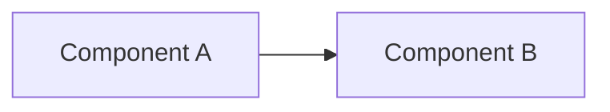

# Reference: Output Structure

The full directory layout the skill produces:

```
<output-dir>/
├── 00-README.md                          ← Entry point; read first
├── 01-inventory.md                       ← What's in the repo
├── 02-architecture/
│   ├── 01-context.md                     ← C4 L1: system + externals
│   ├── 02-containers.md                  ← C4 L2: services, DBs, queues
│   ├── 03-components.md                  ← C4 L3: modules inside containers
│   ├── 04-data.md                        ← Schema, ER diagram, caching
│   ├── 05-deployment.md                  ← Dockerfiles, k8s, IaC, CI/CD
│   └── 06-cross-cutting.md               ← Auth, config, logging, errors
├── 03-features/
│   ├── 00-catalog.md                     ← Feature index table
│   ├── 01-<feature-slug>.md              ← One detailed design per feature
│   ├── 02-<feature-slug>.md
│   └── ...
├── 04-nfrs/
│   ├── 01-security.md
│   ├── 02-performance.md
│   ├── 03-scalability.md
│   ├── 04-reliability.md
│   ├── 05-observability.md
│   ├── 06-maintainability.md
│   ├── 07-compatibility.md
│   └── 08-compliance.md
└── 05-traceability.md                    ← Feature × Module × NFR matrix
```

## File naming rules

- Two-digit prefixes for ordering. Padding to 2 digits handles up to 99 features.
- Slugs in kebab-case, lowercase, no spaces.
- Feature slugs from the feature name: "Order management" → `01-order-management.md`.

## Cross-linking

Every doc should link to:
- `../00-README.md` at the top
- Related docs in context (e.g. a feature doc citing the auth setup links to `../02-architecture/06-cross-cutting.md#auth`)

Use relative links so the docs are portable.

## Mermaid block convention

````markdown

````

All renderers expect the `mermaid` language tag. Don't use `mmd` or other aliases.

## Citation convention

Inline code-style: `` `src/api/orders.ts:42-58` ``

For block quotes from code, use a fenced block with the language and a caption line above:

````markdown
**`src/api/orders.ts:42-58`:**
```typescript
if (!user.canPlaceOrder()) {
  throw new ForbiddenError('USER_NOT_ELIGIBLE');
}
```
````

## Length targets

| Doc | Target length |
|---|---|
| 00-README.md | 1 page (~400 words) |
| 01-inventory.md | 2–4 pages |
| 02-architecture/*.md | 2–5 pages each |
| 03-features/00-catalog.md | 1–2 pages |
| 03-features/<feature>.md | 2–6 pages each |
| 04-nfrs/*.md | 1–4 pages each |
| 05-traceability.md | 1 page (it's a table) |

If a doc is much longer than this, you're probably narrating code. Cut.
