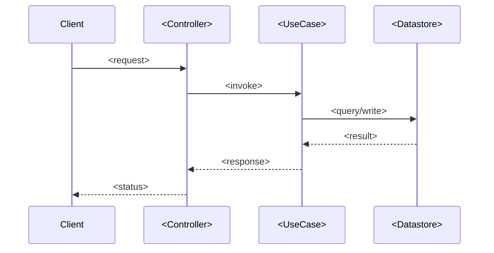

# Feature: <Feature Name>

[← Back to README](../00-README.md) | [← Back to Catalog](./00-catalog.md)

## Overview

<2–4 sentences. What the user sees, why it exists, who uses it.>

## Entry points

| Trigger | Location | Notes |
|---|---|---|
| `POST /api/...` | `path/to/handler.ext:LL` | <auth required? rate limited?> |
| (CLI / queue / cron / etc.) | ... | ... |

## Sequence

**Step notes:**

1. <Non-obvious step explained, with file:line citation.>
2. ...

## Data

**Read:**
- `<table or entity>` — <which columns / fields, indexes used>

**Written:**
- `<table or entity>` — <which columns, state transitions, transactional grouping>

**Cached:**
- <key pattern, TTL, invalidation> — `<file:line>` — or "None."

## Business rules

> R1. <Rule statement in plain English.> — `<file:line>`
>
> R2. <Rule statement.> — `<file:line>`
>
> ...

## Error handling

| Error / condition | Trigger | Response | Where |
|---|---|---|---|
| `<ErrorType>` | <when it fires> | <HTTP code, payload shape, or behavior> | `<file:line>` |

## Dependencies

- **Other features:** <names + links>
- **External services:** <name, timeout, retry config> — `<file:line>`
- **Cross-cutting:** <auth / config / logging — link to `../02-architecture/06-cross-cutting.md`>

## Limitations & known issues

- <TODO / FIXME comment, with file:line>
- <Feature flag gating part of this — link to flag definition>
- <Coexisting old/new code paths, if any>
- "None observed." is a valid entry.

## How to extend

To add <obvious next change>, you would touch:
- `<file>` — <what changes>
- `<file>` — <what changes>
- Migration: <yes/no, and what>
- Tests: `<test file path>`
