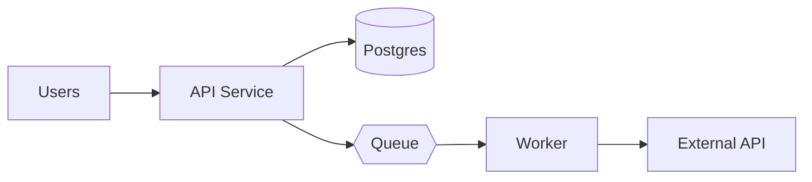

# <System Name> — Reverse-Engineered Design Documentation

> Reverse-engineered from source on `<YYYY-MM-DD>`. Represents the state of the code at that point.

## What this system does

<2–4 sentences. Observed from code. If the business purpose isn't clear, say what the system *is*, not what you imagine it serves.>

## At a glance

| | |
|---|---|
| Primary language | <e.g. TypeScript> |
| Framework | <e.g. NestJS + Postgres + Redis> |
| Deployment | <e.g. Kubernetes, recovered from `k8s/`> |
| Containers | <count> (`<list>`) |
| Features documented | <count> |
| Documentation depth | Architecture + Detailed Design + NFRs |

## High-level architecture

## How to read this documentation

Pick your role:

### **New engineer joining the team** — start here:
1. This README
2. [`01-inventory.md`](./01-inventory.md) — what's in the repo
3. [`02-architecture/02-containers.md`](./02-architecture/02-containers.md) — the moving parts
4. [`02-architecture/06-cross-cutting.md`](./02-architecture/06-cross-cutting.md) — patterns used everywhere
5. Skim [`03-features/00-catalog.md`](./03-features/00-catalog.md), then read the 2–3 features you'll work on first.

### **Architect reviewing for changes** — start here:
1. [`02-architecture/`](./02-architecture/) — all six files
2. [`05-traceability.md`](./05-traceability.md) — impact analysis
3. [`04-nfrs/`](./04-nfrs/) — non-functional posture

### **Security auditor** — start here:
1. [`02-architecture/06-cross-cutting.md`](./02-architecture/06-cross-cutting.md) — auth, secrets, error handling
2. [`04-nfrs/01-security.md`](./04-nfrs/01-security.md) — full security review
3. [`04-nfrs/08-compliance.md`](./04-nfrs/08-compliance.md) — privacy and compliance signals
4. [`05-traceability.md`](./05-traceability.md) — to scope by feature

### **Ops / SRE** — start here:
1. [`02-architecture/05-deployment.md`](./02-architecture/05-deployment.md)
2. [`04-nfrs/04-reliability.md`](./04-nfrs/04-reliability.md)
3. [`04-nfrs/05-observability.md`](./04-nfrs/05-observability.md)
4. [`04-nfrs/03-scalability.md`](./04-nfrs/03-scalability.md)

## Full table of contents

- [`01-inventory.md`](./01-inventory.md)
- Architecture:
    - [`02-architecture/01-context.md`](./02-architecture/01-context.md) — system context
    - [`02-architecture/02-containers.md`](./02-architecture/02-containers.md) — containers
    - [`02-architecture/03-components.md`](./02-architecture/03-components.md) — components
    - [`02-architecture/04-data.md`](./02-architecture/04-data.md) — data
    - [`02-architecture/05-deployment.md`](./02-architecture/05-deployment.md) — deployment
    - [`02-architecture/06-cross-cutting.md`](./02-architecture/06-cross-cutting.md) — cross-cutting
- Features:
    - [`03-features/00-catalog.md`](./03-features/00-catalog.md) — catalog
    - <list each feature doc>
- NFRs:
    - [`04-nfrs/01-security.md`](./04-nfrs/01-security.md)
    - [`04-nfrs/02-performance.md`](./04-nfrs/02-performance.md)
    - [`04-nfrs/03-scalability.md`](./04-nfrs/03-scalability.md)
    - [`04-nfrs/04-reliability.md`](./04-nfrs/04-reliability.md)
    - [`04-nfrs/05-observability.md`](./04-nfrs/05-observability.md)
    - [`04-nfrs/06-maintainability.md`](./04-nfrs/06-maintainability.md)
    - [`04-nfrs/07-compatibility.md`](./04-nfrs/07-compatibility.md)
    - [`04-nfrs/08-compliance.md`](./04-nfrs/08-compliance.md)
- [`05-traceability.md`](./05-traceability.md)

## Conventions used in this documentation

- **[Observed]** — fact directly evidenced in code (with citation).
- **[Inferred]** — deduction from code, not stated outright.
- **[Unknown]** — gap that the code does not answer.
- **Severity tags** in NFR findings: 🔴 Critical / 🟠 High / 🟡 Medium / 🔵 Low.
- **Citations** are `` `file/path:line-range` `` and refer to the codebase as of the generation date above.
